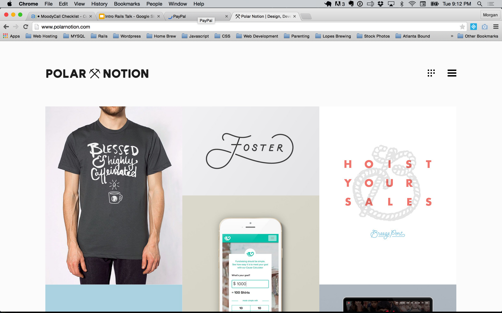
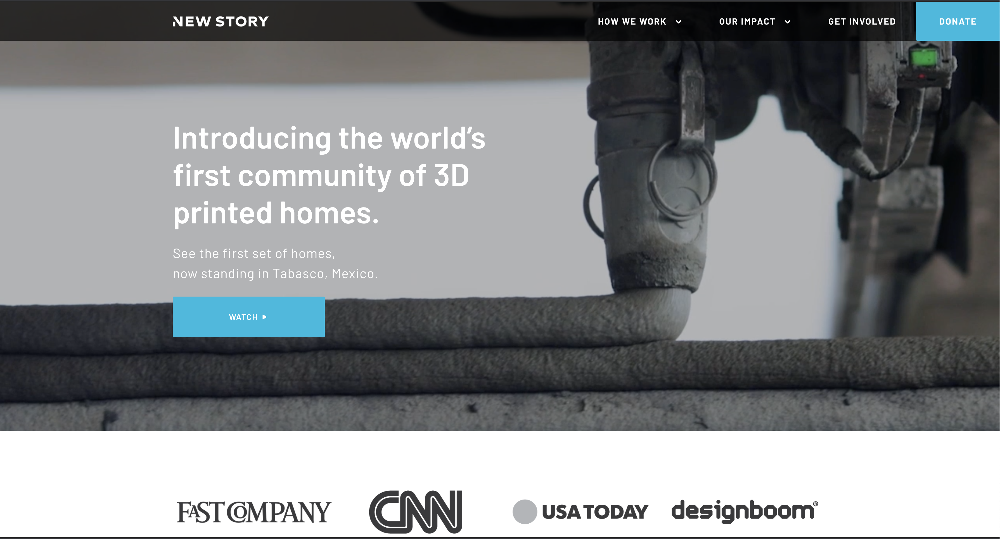

<!-- #5e5eff -->
<!-- https://www.markdownguide.org/cheat-sheet/ -->
<!-- https://docs.deckset.com/English.lproj/getting-started.html -->
<!-- https://docs.google.com/presentation/d/1t77Q7CUKFGDp-KXMYx9ngbfqTGZ-vL85w6pOXvan*bs/edit?usp=sharing -->

[.header: alignment(center), color(#ffffff)]

# A DAY IN THE LIFE OF A DEVELOPER  \

---
[.header: alignment(center), text-scale(.6), color(#5e5eff), line-height(1.2), Barlow bold]

## If we only covered 1 concept, what do you want to know?

---

[.header: alignment(center), text-scale(.6), color(#5e5eff), line-height(.8), Barlow bold]

### MOST COMMON TREND
# Imposter Syndrome

---

# WE WILL COVER

Daily life
Tools on the job
Styles of business
Options to make money

---

---

# YOUR NETWORK

Guides: *Coach, Advisor, Mentor*
Peers: *Coworkers, Colleague, Counterparts*
Mentees: *Direct Supports, Juniors*

---

# MAKING MONEY

Employment
Freelance
Entrepreneurship

---

# CONSIDERATIONS

• Focus
• Control
• Flexibility
• Consistency
• Complexity
• Collaboration
• Growth Potential

---

---

---

---

---

# TYPES OF BUSINESS

Product: *We sell technology*
Service: *We build technology for others*
Support: *We use technology*

---

# SIZE OF BUSINESS

Startup
SMB (Small and Medium-sezed Business)
Corporation

---

# THREE PATHS

Individual Contributor: *Run the play*
People Manager: *Manage the players and direct the play*
Principal: *Create the play*

---

# DAILY SCHEDULE

• Reference cards (features/tasks) in Jira
• Write the code needed to complete the card
• Gather feedback via Pull Requests in Github
• Make revisions
• Deploy code

---

# Randomly 

• 1-1s
• Retrospective / Post Mortems
• Planning
• Brainstorming
• Housekeeping Tasks
• Company Meetings
• Department Meetings

--- 

# BOOK RECOMMENDATIONS

Deep Work *Newport*
The Power of Habit *Duhigg*
The Compound Effect *Hardy*

---

# TOOLS

• Web Browser *(Chrome, Safari, Firefox…)*
• Text Editor *(Sublime, Textmate, VIM …)*
• Notes *(Notes, Evernote, Bear, Obsidian …)*
• Project Management *(Jira, Asana, Basecamp …)*
• Source Code *(Github, BitBucket, GitLab …)*
• Dev Ops *(Heroku, AWS …)*
• Chat *(Slack, Teams, Hipchat …)*
• Docs *(Docs, Word, Notion …)*
• Calendar *(iCal, Google Calendar …)*
• Video Call *(Zoom, Hangouts, Slack ...)*

---

# HOW TO STAND OUT

• Focus
• Plan
• Respond
• Follow-through
• Followup
• Reflect

---

> Pursue Excellence, Not Perfection

---

# BE CONSISTENT

---

# BE BOLD

---

# SHARE YOUR FEEDBACK
<!-- https://form.jotform.com/70516790364964 -->
<!-- https://www.amazon.com/Code-School-Overcome-Syndrome-Kick-Start/dp/1736080709 -->